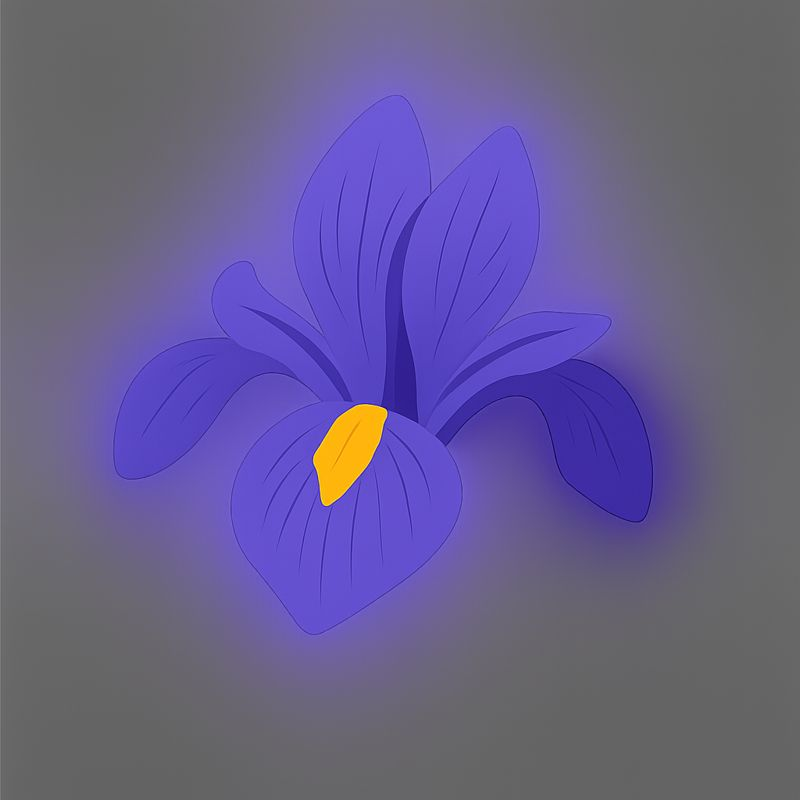

```{r setup, include=FALSE}
#Install the following libraries if required
library(shiny)
library(flexdashboard)
library(tidyverse)
library(cluster)
library(factoextra)
library(fpc)
library(DT)
library(plotly)

options(scipen = 999)
theme_set(theme_minimal(base_size = 12))
```

```{r data_objects, include=FALSE}
# Built-in dataset shipped with R
data(iris)

# Numeric feature matrix
iris_features <- iris %>% select(Sepal.Length, Sepal.Width, Petal.Length, Petal.Width)
iris_scaled   <- scale(iris_features)

# Fit a single K-Means model (k = 3) once; visuals + diagnostics will respond via filtering
set.seed(123)
kmeans_model <- kmeans(iris_scaled, centers = 3, nstart = 25)

# Attach clusters to the original data
iris_kmeans <- iris %>%
  mutate(
    KMeansCluster = factor(kmeans_model$cluster),
    Species = factor(Species)
  )

# PCA (for visualization)
pca_model <- prcomp(iris_scaled, center = TRUE, scale. = TRUE)
pca_scores <- as_tibble(pca_model$x[, 1:2]) %>% rename(PC1 = PC1, PC2 = PC2)

# One "analysis-ready" table used everywhere
iris_aug <- bind_cols(iris_kmeans, pca_scores)

# Cluster centers (on standardized scale) for reference
centers_tbl <- as_tibble(kmeans_model$centers) %>%
  mutate(Cluster = factor(row_number())) %>%
  relocate(Cluster)

# Helper for ARI
compute_ari <- function(cluster_labels, dist_matrix, true_labels) {
  fpc::cluster.stats(
    d = dist_matrix,
    clustering = as.numeric(factor(cluster_labels)),
    alt.clustering = as.numeric(factor(true_labels))
  )$corrected.rand
}
```

```{r reactives, include=FALSE}
# Shared reactive filters (one set of controls drives all visuals)
filtered_data <- reactive({
  df <- iris_aug

  if (!is.null(input$species_filter) && length(input$species_filter) > 0) {
    df <- df %>% filter(Species %in% input$species_filter)
  }
  if (!is.null(input$cluster_filter) && length(input$cluster_filter) > 0) {
    df <- df %>% filter(KMeansCluster %in% input$cluster_filter)
  }

  df
})

# Distances + diagnostics computed on the filtered subset
filtered_dist <- reactive({
  df <- filtered_data()
  if (nrow(df) < 3) return(NULL)

  x <- df %>% select(Sepal.Length, Sepal.Width, Petal.Length, Petal.Width) %>% scale()
  dist(x)
})

avg_sil_width <- reactive({
  d <- filtered_dist()
  df <- filtered_data()

  # Need enough rows and at least 2 clusters in the subset
  if (is.null(d) || d[1] != d[1] || length(unique(df$KMeansCluster)) < 2) return(NA_real_)

  sil <- cluster::silhouette(as.numeric(df$KMeansCluster), d)
  mean(sil[, "sil_width"])
})

ari_kmeans <- reactive({
  d <- filtered_dist()
  df <- filtered_data()

  # Need distances and at least 2 levels in both labels for a meaningful ARI
  if (is.null(d) ||
      length(unique(df$KMeansCluster)) < 2 ||
      length(unique(df$Species)) < 2) return(NA_real_)

  compute_ari(df$KMeansCluster, d, df$Species)
})

color_vector <- reactive({
  df <- filtered_data()
  if (is.null(input$color_by) || input$color_by == "cluster") df$KMeansCluster else df$Species
})

legend_title <- reactive({
  if (is.null(input$color_by) || input$color_by == "cluster") "Cluster" else "Species"
})
```

Sidebar {.sidebar}
--------------------------------------------------------------------------------



### Filters
```{r sidebar_controls, echo=FALSE}

# Color by radio buttons
radioButtons(
  inputId = "color_by",
  label   = "Color points by",
  choices = c("K-Means Cluster" = "cluster", "Species" = "species"),
  selected = "cluster"
)

# 
checkboxGroupInput(
  inputId = "species_filter",
  label   = "Species",
  choices = levels(iris$Species),
  selected = levels(iris$Species),
  inline = FALSE
)

# 
checkboxGroupInput(
  inputId = "cluster_filter",
  label   = "Clusters (k = 3)",
  choices = levels(iris_kmeans$KMeansCluster),
  selected = levels(iris_kmeans$KMeansCluster),
  inline = FALSE
)
```

&nbsp;
&nbsp;


---


  © 2025 Seif Kungulio  


Row {data-height=110}
--------------------------------------------------------------------------------

### **Dataset**
```{r}
renderValueBox({
  df <- filtered_data()
  valueBox(
    value   = nrow(df),
    caption = "<b>Observations in view</b>",
    icon    = "fa-database"
  )
})
```

### **Species**
```{r}
renderValueBox({
  df <- filtered_data()
  valueBox(
    value   = length(unique(df$Species)),
    caption = "<b>Species present</b>",
    icon    = "fa-leaf"
  )
})
```

### **Clusters**
```{r}
renderValueBox({
  df <- filtered_data()
  valueBox(
    value   = length(unique(df$KMeansCluster)),
    caption = "<b>Clusters present</b>",
    icon    = "fa-circle-nodes"
  )
})
```

### **Silhouette**
```{r}
renderValueBox({
  s <- avg_sil_width()
  valueBox(
    value   = ifelse(is.na(s), "—", sprintf("%.3f", s)),
    caption = "<b>Avg silhouette width</b>",
    icon    = "fa-chart-line"
  )
})
```


Row {data-height=340}
--------------------------------------------------------------------------------

### **Cluster Scatterplot (Petal measurements)**
```{r}
renderPlotly({
  df <- filtered_data()
  req(nrow(df) > 1)

  p <- ggplot(
    df,
    aes(
      x = Petal.Length,
      y = Petal.Width,
      color = color_vector(),
      text = paste(
        "Sepal.Length:", Sepal.Length,
        "<br>Sepal.Width:", Sepal.Width,
        "<br>Petal.Length:", Petal.Length,
        "<br>Petal.Width:", Petal.Width,
        "<br>Species:", Species,
        "<br>Cluster:", KMeansCluster
      )
    )
  ) +
    geom_point(alpha = 0.85, size = 2.8) +
    labs(
      title = "Petal Length vs Petal Width (Filtered)",
      x = "Petal.Length",
      y = "Petal.Width",
      color = legend_title()
    ) +
    theme(legend.position = "bottom")

  ggplotly(p, tooltip = "text") %>% layout(legend = list(orientation = "h"))
})
```
> Scatterplot of Petal Length vs Petal Width for the filtered iris data, colored by either K-Means clusters or true species labels.

### **K-Means View (PCA space)**
```{r}
renderPlotly({
  df <- filtered_data()
  req(nrow(df) > 1)

  p <- ggplot(df, aes(x = PC1, y = PC2, color = color_vector())) +
    geom_point(alpha = 0.85, size = 2.6) +
    stat_ellipse(aes(group = KMeansCluster), linetype = 2, linewidth = 0.6, show.legend = FALSE) +
    labs(
      title = "Filtered Data in PCA Space",
      subtitle = "Ellipses are drawn by K-Means clusters (k = 3)",
      x = "PC1",
      y = "PC2",
      color = legend_title()
    ) +
    theme(legend.position = "bottom")

  ggplotly(p, tooltip = c("x", "y")) %>% layout(legend = list(orientation = "h"))
})
```
> Scatterplots showing the filtered iris data colored by either K-Means clusters or true species labels.


Row {data-height=340}
--------------------------------------------------------------------------------

### **ARI vs. Species**
```{r}
renderPlot({
  a <- ari_kmeans()
  validate(need(!is.na(a), "ARI needs at least 2 species and 2 clusters in the filtered view."))

  tibble(metric = "Adjusted Rand Index", value = a) %>%
    ggplot(aes(x = metric, y = value)) +
    geom_col() +
    coord_flip() +
    scale_y_continuous(limits = c(0, 1)) +
    labs(title = "Agreement Between K-Means and True Species (Filtered)")
})
```
> Bar plot showing the Adjusted Rand Index (ARI) between K-Means clusters and true species labels in the filtered dataset.

### **Silhouette Plot**
```{r}
renderPlot({
  d <- filtered_dist()
  df <- filtered_data()

  validate(
    need(!is.null(d), "Select at least 3 observations to compute silhouette."),
    need(length(unique(df$KMeansCluster)) >= 2, "Silhouette needs at least 2 clusters in the filtered view.")
  )

  sil <- cluster::silhouette(as.numeric(df$KMeansCluster), d)
  factoextra::fviz_silhouette(sil) +
    labs(title = "Silhouette Widths (Filtered View)")
})
```
> Silhouette plot showing how well each observation fits within its assigned cluster in the filtered dataset.


Row {.tabset data-height=340}
--------------------------------------------------------------------------------

### **Cluster Centers**
```{r}
renderDataTable({
  datatable(
    centers_tbl,
    options = list(pageLength = 5),
    rownames = FALSE
  )
})
```
> The K-Means cluster centers on the standardized feature scale.

### **Filtered Iris Data**
```{r}
renderDataTable({
  df <- filtered_data() %>%
    select(Sepal.Length, Sepal.Width, Petal.Length, Petal.Width, Species, KMeansCluster, PC1, PC2)

  datatable(
    df,
    options = list(pageLength = 10),
    rownames = FALSE
  )
})
```
> The iris dataset with K-Means cluster assignments and PCA scores, filtered based on sidebar selections.
